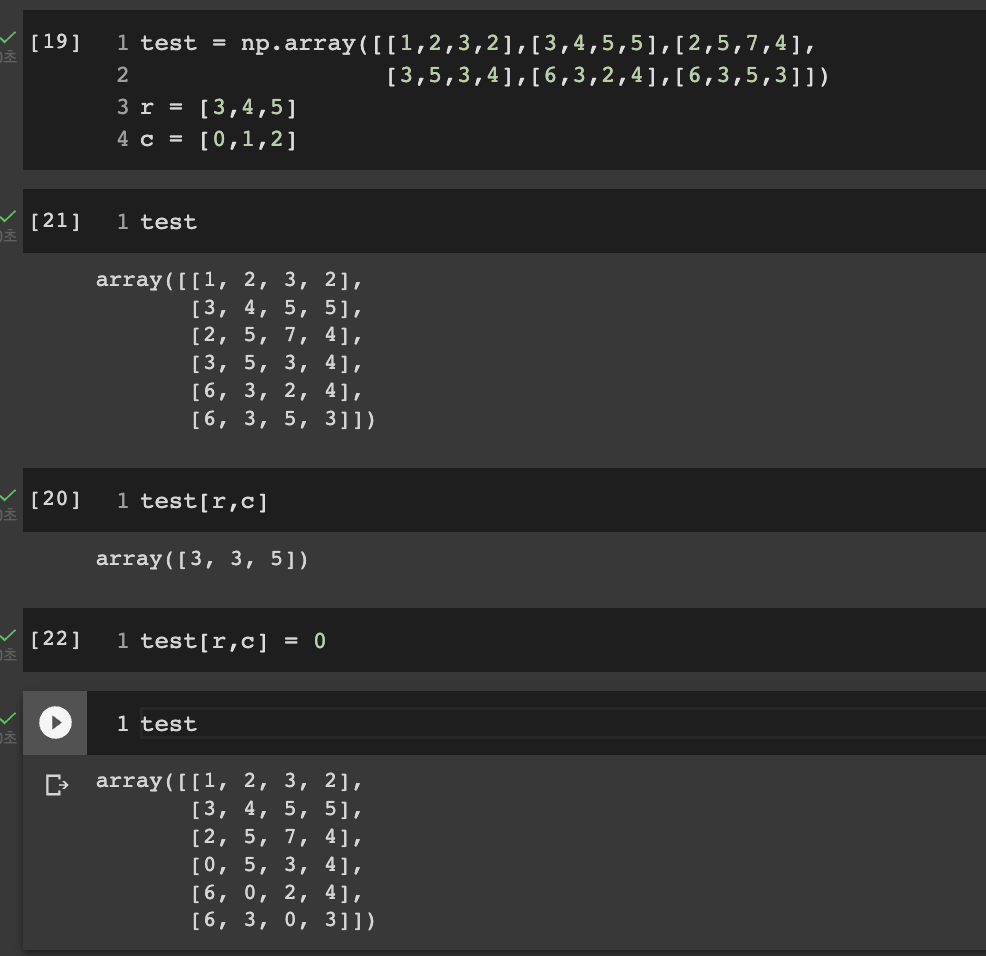

## Numpy 인덱싱 새로 안 기능 : 리스트 인덱싱
</br>

cs231n Assignment #1 softmax 문제 중에 for loop을 vectorized 시켜야 했다.

```
   def softmax(x,w):
        f = x.dot(w)
        f -= np.max(f)

        soft_fun = np.exp(f) / np.sum(np.exp(f), axis=1)[:, np.newaxis]     
        correct = np.zeros(y.shape)
        for i in range(x.shape[0]):
            correct[i] = soft_fun[i, y[i]]
        loss_sum = np.mean(-np.log(correct))
        reg_loss = reg * np.sum(w**2)

        return loss_sum + reg_loss
```
여기서 
```
for i in range(x.shape[0]):
    correct[i] = soft_fun[i, y[i]]
```
요 for loop 을 없애야 했는데 생각보다 간단했다.
(그냥 내가 Numpy 기초가 부족해서 못 푼듯...)

```
correct = soft_fun[np.arange(N_x), y] # ⭐️⭐️⭐️
```
이렇게 하면 같은 결과를 낸다!!
이게 무슨 원리인고 하니



요로코롬  

 첫번째 행 리스트는 3이고, 열 리스트는 0이니까 test[3,0]을 인덱싱하게 된다.  
 => test[3,0] = 3
 
 두번째 행 리스트는 4이고, 열 리스트는 1이니까 test[4,1]을 인덱싱하게 된다.  
 => test[4,1] = 3

 세번째 행 리스트는 5이고, 열 리스트는 2이니까 test[5,2]을 인덱싱하게 된다.  
 => test[5,2] = 5


 이런식으로 각각 인덱싱한 값을 array 형식으로 뽑아주게 된다.  
 => test[r,c] = array([3,3,5])  


